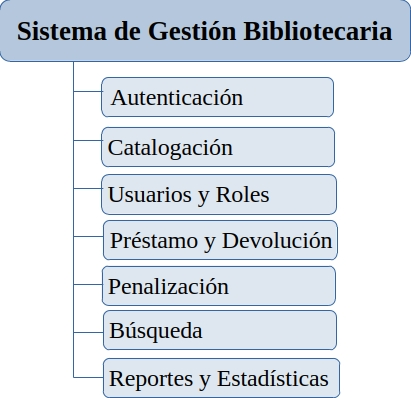

# Sistema de Gestión Bibliotecaria (API)

 

API RESTful desarrollada con Laravel para la gestión bibliotecaria. Esta API utiliza JWT para autenticación y ofrece endpoints para administrar catálogos, autores, editoriales, ejemplares, usuarios y permisos.

**Módulos**

<a href="https://github.com/osneida/biblioteca/wiki"> Documentación de la Api <a>

<a href="https://github.com/users/osneida/projects/5/views/2"> Proyecto de la Api <a>

<a href="https://github.com/osneida/biblioteca/wiki/Ejemplo-de-endpoints"> Ejemplos de filtros y endpoints <a>

---

**Principales características**

-   Autenticación JWT.
-   Paginación y filtros avanzados (select, include, sort, filter, in/not_in, like/not_like).
-   Roles y permisos con Spatie.
-   Tests automatizados con PHPUnit.
-   Documentación automática (Scramble).

**Requisitos**

-   PHP 8.2+
-   Composer
-   Node.js >= 18 (para assets)
-   Base de datos compatible (MySQL, SQLite, PostgreSQL, etc.)

**Instalación rápida**

1. Clona el repositorio:
   git clone https://github.com/osneida/biblioteca.git
2. Instala dependencias PHP:
   composer install
3. Instala dependencias JS:
   npm install
4. Copia el entorno y genera claves:
   cp .env.example .env
   php artisan key:generate
5. Configura la base de datos en .env.
6. Ejecuta migraciones y seeders:
   php artisan migrate --seed
7. Levanta la aplicación (desarrollo):
   composer run dev

**Configuración importante**

-   JWT: la configuración del proveedor JWT está en [config/jwt.php](config/jwt.php). Para tests recuerda añadir `JWT_SECRET` en `.env.testing`. El trait de test provee un comando sugerido para generar el secreto en `.env.testing`: consulta [`App\Trait\Test\AuthenticatesAsCataloger`](app/Trait/Test/AuthenticatesAsCataloger.php).
-   Documentación de la API: la configuración de Scramble se encuentra en [config/scramble.php](config/scramble.php).

**Autenticación**

-   La API usa tokens JWT. Para peticiones autenticadas envía la cabecera:
    Authorization: Bearer <token>
-   En pruebas y ejemplos ya se crea un usuario de prueba mediante seeders/tests (ver tests).

**Ejemplos de uso de filtros y endpoints**

-   Listado con includes y filtros:
    GET /api/v1/catalogos?include=autores,editorial&filters[id][in]=5,6,7
-   Búsqueda por título (LIKE):
    GET /api/v1/catalogos?filters[titulo][like]=libro
-   Detalle con relaciones:
    GET /api/v1/catalogos/16?include=ejemplares,autores&select=id,titulo

-   Ejemplos adicionales y explicaciones están en la documentación del proyecto y en los tests: [tests/Feature/EditorialTest.php](tests/Feature/EditorialTest.php) y [tests/Feature/AutorTest.php](tests/Feature/AutorTest.php).

**Pruebas**

-   Ejecutar tests:
    php artisan test
-   Asegúrate de tener `.env.testing` configurado, incluyendo `JWT_SECRET` los tests usan JWT. Está configurado en Trait/Test/AuthenticatesAsCataloger

Scripts útiles (desde composer.json)

-   Recomendado revisar dependencias y scripts en [composer.json](composer.json).

**Buenas prácticas y contribución**

-   Sigue el formato PSR-12.
-   Añade tests para nuevas funcionalidades.
-   Abre un issue antes de una PR grande; las PRs pequeñas y enfocadas se revisan más rápido.

**Contacto y documentación**

-   Documentación en el repositorio y Wiki del proyecto.
-   Para la exportación automática de la especificación OpenAPI consulta la configuración en [config/scramble.php](config/scramble.php).

**Licencia**

-   MIT (ver composer.json).

**Notas rápidas**

-   Si trabajas con tests que requieren autenticación JWT revisa [`App\Trait\Test\AuthenticatesAsCataloger`](app/Trait/Test/AuthenticatesAsCataloger.php) para el flujo de creación de usuario y generación de token.
-   Para cambiar proveedores JWT revisa [config/jwt.php](config/jwt.php).
